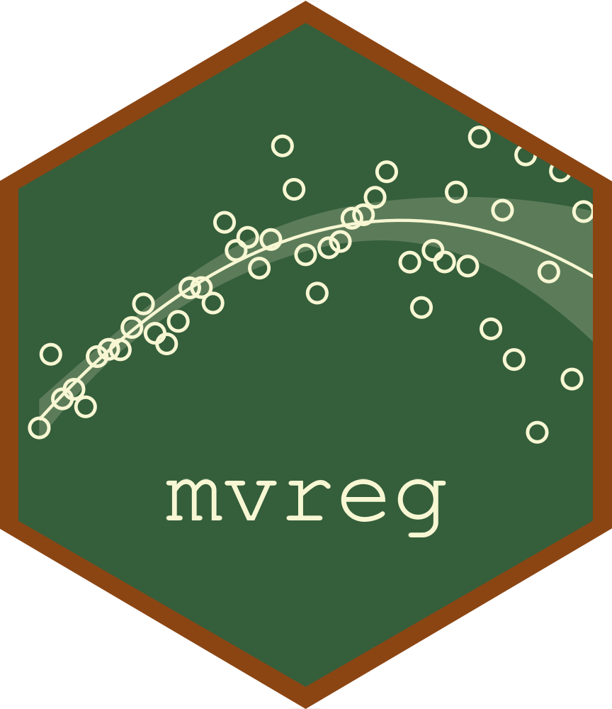

<!-- README.md is generated from README.Rmd. Please edit that file -->

```{r, include = FALSE}
knitr::opts_chunk$set(
  collapse = TRUE,
  comment = "#>",
  fig.path = "man/figures/README-",
  out.width = "100%"
)
```

```{r setup, include = F}
library(mvreg)
suppressMessages(require(dplyr))
suppressMessages(require(ggplot2))
suppressMessages(require(ggthemes))

cat('<style>
  img.logo {
    background-color: transparent !important;
  }
</style>')

```


# mvreg 


<!-- badges: start -->


<!-- badges: end -->

```{r, include = F}
cat('<br><br>')
```

The mvreg package provides tools for estimating linear regression models where both the mean and variance components are modeled as linear functions of predictors. This package extends traditional linear regression by allowing the variance of the response variable to depend on a set of covariates, making it useful for scenarios where heteroscedasticity (non-constant variance) is present.


## Installation

You can install the development version of mvreg from [GitHub](https://github.com/) with:

``` r
devtools::install_github("giovannitinervia9/mvreg")
```

## Model specification
The heteroscedastic linear model is specified as $$Y_i|\mathbf{x}_i, \mathbf{z}_i \sim \mathcal{N}(\mu_i = \mathbf{x}_i'\boldsymbol{\beta}, \sigma^2_i = \exp\{\mathbf{z}_i'\boldsymbol{\tau}\})$$ $\mathbf{x}_i$ and $\mathbf{z}_i$ are both row vectors of covariates, the former for the mean component and the latter for the variance component, and they need not be equal. $\boldsymbol{\beta}$ and $\boldsymbol{\tau}$ are the vectors of parameters for the mean and variance components, respectively.

Variance component is modelled via a logarithmic link function

$$\log(\sigma^2_i) = \mathbf{z}_i'\boldsymbol{\tau}$$

## How to fit a heteroscedastic linear model

To fit a heteroscedastic linear model, you can use `mvreg()` function, in which you can specify a `formula.mu` for the mean component and a `formula.s2` for the variance component.

Take, for example, the dataset `iris` and let's fit a model in which `Sepal.Length` depends on `Species` for both the mean and variance components
```{r}
mod <- mvreg(formula.mu = Sepal.Length ~ Species,
             formula.s2 = Sepal.Length ~ Species,
             data = iris)
summary(mod)
```

